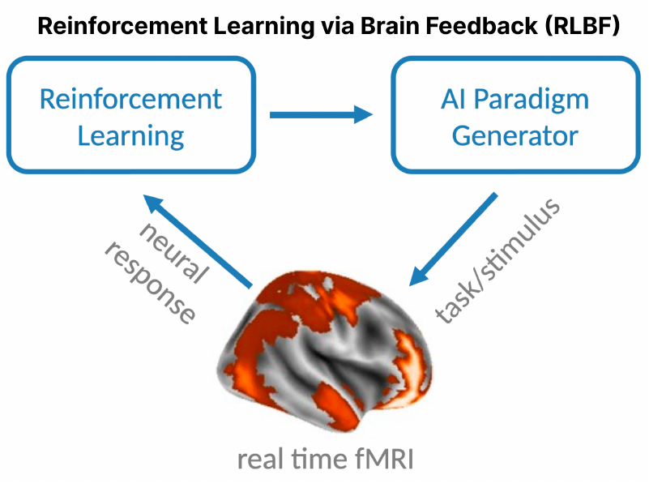
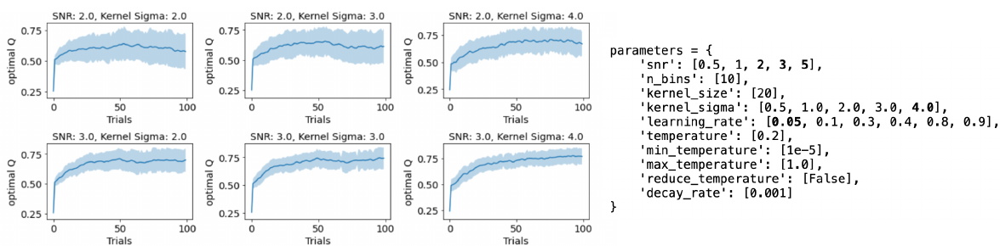

Towards generative AI-based fMRI paradigms: reinforcement learning via real-time brain feedback
========
Giuseppe Gallitto<sup>1,2</sup>, Robert Englert<sup>2,3</sup>, Balint Kincses<sup>1,2</sup>, Raviteja Kotikalapudi<sup>1,2</sup>, Jialin Li<sup>1,2,4</sup>, Kevin Hoffshlag<sup>1,2</sup>, Sulin Ali<sup>1,2</sup>, Ulrike Bingel<sup>1,2</sup>, Tamas Spisak<sup>2,3</sup><br>

<sup>1</sup> Department of Neurology, University Medicine Essen, Germany<br>
<sup>2</sup> Center for Translational Neuro- and Behavioral Sciences (C-TNBS), University Medicine Essen, Germany<br>
<sup>3</sup> Department of Diagnostic and Interventional Radiology and Neuroradiology, University Medicine Essen, Germany<br>
<sup>4</sup> Max Planck School of Cognition, Leipzig, Germany<br>

#### Introduction
In traditional human neuroimaging experiments, researchers construct experimental paradigms with
a certain psychological/behavioral construct validity to infer the corresponding neural correlates.
Here we introduce a novel approach called Reinforcement Learning via Brain Feedback (RLBF),
that inverts the direction of inference; it searches for the optimal stimulation or paradigm to
maximize (or minimize) response in predefined brain regions or networks (fig.1). The stimulation/
paradigm is optimized by reinforcement learning algorithm (Kaelbling et al., 1996) which is
rewarded based on real-time fMRI (Sulzer et al., 2013) data. Specifically, during ongoing real-time
fMRI acquisition, the reinforcement learning agent manipulates the paradigm space (e.g. by means
of a generative AI model) to drive the participant’s neural activity in a specific direction. Then the
agent is rewarded based on the measured brain responses and gradually learns to adjust its choices
to converge towards an optimal solution. Here, we present the results of a proof of concept study
that aimed to confirm the viability of the proposed approach with simulated and empirical real time
fMRI data.


Fig.1: RLBF concept illustration. Brain activity is fed to a reinforcement learning algorithm that find the right paradigm to drive neural activity in the right direction (up- or down-regulation). The loop continues until the agent converges to an optimal solution.

#### Methods
In our proof of concept study, we aimed to construct a streamlined setup. To implement the
reinforcement learner (fig 1. “Reinforcement Learning”), we used a simple and widely used
algorithm, a soft Q-learner (Haarnoja et al., 2017) with a smooth reward function. For the paradigm
space (fig 1. “Paradigm Generator”), we employed simple, algorithmically constructed visual
stimulations. Specifically, we presented various versions of a flickering checkerboard to the
participants, with contrast and frequency considered as free parameters of the paradigm space. A
contrast value of zero resulted in no difference to the resting block. The reward signal for the
reinforcement learner was calculated from brain responses in the primary visual cortex, as measured
by a linear model fitted on a single block of data measured in block-design fashion, with 5 seconds
of visual stimulus followed by 11 seconds of rest. The hypothesis function was convolved with a
conventional double-gamma HRF.
In this setting, the task for the agent was to figure out the optimal contrast-frequency configuration
that maximizes a participant’s brain activity in the primary visual cortex. First we tested the
feasibility of our approach by running simulations with realistic effect sizes estimates. Specifically,
we defined the optimal ground truth as a linear function of contrast and flickering frequency, with
maximum activation with maximal contrast and a frequency of 7Hz. In one simulation run, the
reinforcement learner had 100 trials. In each trial the agent picked a contrast and frequency value
and updated its Q-table based on the reward that was calculated by our ground truth equation, with
added Gaussian noise. We fine-tuned the hyperparameters for the models using realistic initial
conditions (signal-to-noise: 0.5 - 5; q-table smoothness: 0.5 - 4.0; soft-Q temperature: 0.2; learning
rate: 0.05 - 0.9).
With parameters chosen based on our simulation results, we measured data in n=10 participants, to
establish the proof of concept. In the empirical measurements, we presented the checkerboard in 35-45
blocks/trials with a TR of 1 second (1 block: 5 sec stimulation, 11 seconds of rest, total scanning
time 10 minutes) and allowed the reinforcement learner to optimize the visual stimulation based on
brain feedback.

#### Results
Simulation results show that the proposed implementation provides robust solution in a relatively
wide range of initial conditions, within a small amount of trials. High smoothing power appears to
function well with higher SNRs, whereas lower SNRs seem to require lower learning rates for
optimal training (fig.2a). The model displayed a remarkably stability with a wide range of learning
rate values. Results from the empirical measurements (fig.2b) are in line with knowledge about the
contrast and frequency dependence of the checkerboard-response (Victor et al., 1997) and provide
initial confirmation for the feasibility of the proposed approach.


Fig.2: Results of our proof of concept study for the simulation and the empirical real-time fMRI acquisitions. The simulation shows the Q value for the optimal condition (contrast: 1.0, frequency: 0.7) and the best learning rate across 100 trials (a). The real-time acquisition of a single session (b) shows that the agent is able to converge to a robust solution across 45 trials/fMRI blocks.

#### Conclusion
Here we presented a proof of concept for Reinforcement Learning with Brain Feedback (RLBF), a
novel experimental approach, which aims to find the optimal stimulation paradigm to activate,
deactivate or modulate individual brain activity in pre-defined regions/networks. While this proof of
concept study employed a simplified setup, future work aims to extend the approach with paradigm
spaces constructed by generative AI solutions (e.g. large language models, image, video or music
generation). The promises of the approach are twofold. First by inverting the direction of inference
(“brain -> behavior”; instead of “behavior -> brain”) the proposed approach may emerge as a novel
tool for basic and translational research. Second, when paired with generative AI, the RLBF
approach has the potential to provide novel individualized treatment approaches, e.g. in from of AI-
generated text, video or music that is optimized e.g. for improving states of pain or anxiety.

## Software
**N.B.** Our real-time fMRI software is still in an early stage of development, and it is not suitable for general use.
The current version has been tested on one single scanner **and works only** with a very specific setup.

<b> ** Tested with Siemens Magnetom Vida 3T **</b>

### Features
The current version of the program consists in:

- A controller that manages incoming volumes from Siemens' real-time export function.
It handles preprocessing and reinforcement learning with a minimum TR of 1 sec.
- A custom RL environment made in [Raylib 5.0](https://www.raylib.com/) with a flickering
checkerboard that changes in contrast and frequency.
- A custom RL Soft-Q-Learning algorithm based on the work of 
[Haarnoja et al., 2017](https://proceedings.mlr.press/v70/haarnoja17a.html?ref=https://githubhelp.com).
- A Dashboard made in [Streamlit](https://streamlit.io/), to visualize the progress of real-time processing.


### Dependencies
The program has been tested in Ubuntu 20.04.

- Developed using Python 3.11.7.
- Preprocessing strongly depends on [ANTsPy](https://antspyx.readthedocs.io/en/latest/),
except for motion correction that is done using [FSL mcflirt](https://fsl.fmrib.ox.ac.uk/fsl/fslwiki/MCFLIRT).
- The environment runs using the [python version](https://electronstudio.github.io/raylib-python-cffi/README.html#installation) 
of Raylib.
- The Dashboard runs on Streamlit 1.30.0.


### Requirements
1. To avoid slowdowns that hinder the correct rendering of visual stimuli presented to participants a
dedicated graphic card is required to run the Raylib environment.

2. Also you should set up a "/mnt/fmritemp" folder to store temporary data. Ideally the folder
should be a ram disk of at least 1GB size.

### Run the program

Remember to **change the paths** on the "rtfmri_dashboard/controller.py" and "rtfmri_dashboard/envs/render.py" scripts before running.

Run the controller script to start the main program. The environment will spawn by itself
after the reference volume has been preprocessed.
```
python ./rtfmri_dashboard/controller.py
```

Run the Dashboard. The Dashboard is only for visualization purposes and doesn't need to be
run for the controller to work properly.
```
streamlit run ./rtfmri_dashboard/real_time/dashboard.py
```
